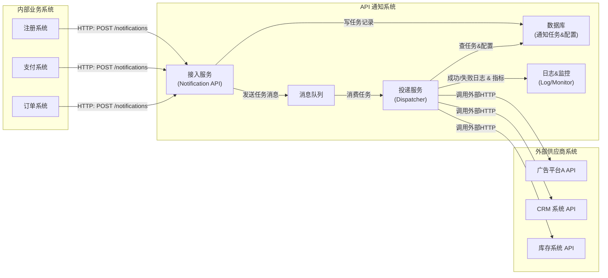
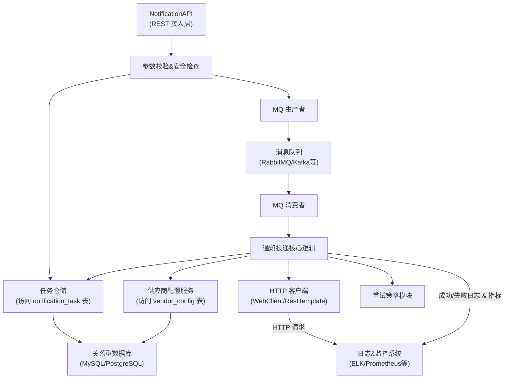
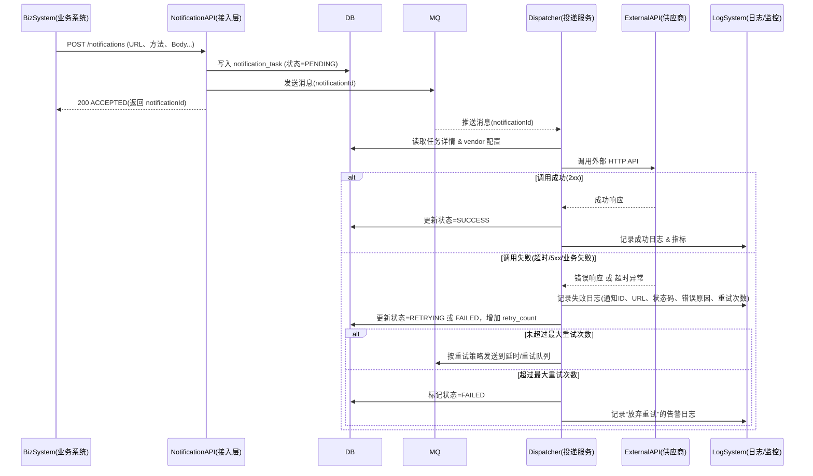

## 我对需求的理解

### 一、业务背景与痛点
**业务场景**：
- 企业内部有多个业务系统（如用户系统、订单系统、订阅系统等）
- 这些系统在关键事件发生时需要通知外部供应商系统
- 外部系统可能是广告平台、CRM、库存系统等第三方服务

**核心痛点**：
1. **接口不统一**：每个外部供应商的 API 地址、格式、认证方式都不同
2. **重复开发**：每个业务系统都要实现调用不同外部 API 的代码
3. **可靠性担忧**：业务系统需要处理网络失败、重试等复杂逻辑
4. **关注点分离**：业务系统应该聚焦业务逻辑，而不是外部通信细节

- **归纳需要解决的问题**：
  - 现在公司里有很多业务系统（注册、支付、下单等），每个都要在关键时刻去调用不同外部供应商的 HTTP(S) 接口发通知（广告平台、CRM、库存系统等）。
  - 不同供应商：URL 不同、Header 不同、Body 格式不同，失败重试逻辑也不好统一。
  - 业务系统的诉求：**我只负责把该通知的内容告诉你，你帮我可靠地送到外面去，不管怎么调外部 API、失败怎么重试。**

- **解决方案**：
  - 做一个独立的“API 通知系统”（Java / Spring Boot 服务），对内暴露一个统一的 HTTP 接口；
  - 内部把这些通知放进消息队列（比如 RocketMQ/Kafka），由专门的消费者服务去按规则重试、回调外部 HTTP API；
  - 业务系统只要把“要通知谁、用什么方法、发什么内容”等信息丢给我们，就算完成任务，不必关心外部系统是否一时挂掉。

- **消息投递语义**：
  - 选择：**“至少一次（At-Least-Once Delivery）”**。
  - 含义：我们尽最大努力保证通知一定会被外部系统收到，宁可在极端情况下重复发送一次，也不要丢失。


## AI对需求的理解

### 1. 统一接入层
- 提供标准化的REST API接口
- 支持API密钥认证
- 请求参数验证

### 2. 异步处理
- 消息队列机制
- 立即响应，后台处理
- 并发投递支持

### 3. 可靠投递
- 智能重试策略（指数退避）
- 超时控制
- 死信队列管理

#### 4. 状态追踪
- 实时查询通知状态
- 完整的投递历史记录
- 30天数据保留

### 5. 监控告警
- Prometheus指标暴露
- 失败率监控
- 死信队列告警
- Webhook告警通知

### 6. 幂等性保证
- 支持幂等性键
- 防止重复投递
- 24小时去重窗口

## 整理后的结果
- **本系统要负责解决的问题**：
   
   **统一入口 API**：
    - 提供标准化 HTTP 接口（如 `POST /notifications`）。
    - 业务方只需提供：
      - 目标回调地址（URL）；
      - HTTP 方法（GET/POST/PUT 等）；
      - 请求头（可选）；
      - 请求体（JSON / 表单等原样透传）；
      - 外部供应商标识（可选，用于按模板/配置拼装请求）。

   **异步可靠投递**：
    - 收到请求后**快速返回“已接收”**，不要阻塞业务请求太久；
    - 把通知写入**持久化存储**（数据库）并发送到**消息队列**；
    - 后台消费者进程从队列中拉取任务，调用外部 HTTP API，并根据结果进行重试或标记完成。
   
   **失败重试与退避**：
    - 配置最大重试次数、重试间隔（支持指数退避，如 1min → 2min → 4min…）；
    - 某个供应商长时间不可用时，任务进入“死信队列”或“失败表”等，待人工或运维排查。
   
   **基本监控与可观测性**：
    - 为每条通知记录状态（待发送、发送中、成功、失败、放弃）；
    - 暴露简单查询接口或管理后台（可以作为后续版本），方便运维查看某条通知的历史尝试记录与错误原因。

- **本系统不解决的事情（关键工程决策与取舍说明）**：
   
   **业务逻辑**
   - 不负责路由决策（业务系统直接指定目标 URL）
   - 不负责数据转换（业务系统传入的数据格式就是最终格式）
   - 不负责业务规则验证
   - 存储每条消息的状态

   **高级功能**
   - 不负责限流、熔断
   - 不负责认证授权
   - 不负责监控大盘
   
   **响应处理**
   - 不解析外部系统的响应内容
   - 不将响应返回给业务系统
   - 仅记录成功/失败状态
   
   **不做复杂的业务编排**：
    - 比如“先通知广告系统，再根据结果通知 CRM，再根据两个系统结果决定是否库存扣减”这类流程编排，属于业务编排/工作流范围；
    - 原因：这会极大提高复杂度，V1 只负责“把一条通知可靠送出去”，不负责多步业务决策。
   
   **不保证 Exactly-Once（严格只投递一次）**：
    - 原因：要做到严格“只一次”通常要依赖外部系统支持幂等键或分布式事务，成本非常高；
    - 我们选择“至少一次”更符合实际工程场景，并要求调用方/外部系统设计成**幂等接口**（例如用唯一业务 ID 去重）。
   
   **不负责外部系统的业务含义**：
    - 外部系统如果业务逻辑出错（比如库存系统内部计算错），不属于本系统职责；
    - 本系统只负责“调用接口 + 记录结果”。
   
   **不在 V1 实现复杂路由、动态限流、灰度发布等高级能力**：
    - 这类需求在流量极大、外部系统非常多时才有价值，先保留为演进方向。

   **组件选型**：
    - 使用rocketMQ队列，支持延迟消息
    - 前期支持Http方式调用，RPC方式暂不支持


## API 通知系统（API Notification System）

### 1. 项目简介

**项目目标**：为企业内部多个业务系统提供一个统一、标准化的 HTTP 接口，用于在关键业务事件发生时，可靠地调用外部供应商提供的 HTTP(S) API。

**典型场景示例**：
- **广告投放回传**：用户通过第三方广告系统引流并成功注册后，向对应广告系统回传注册事件。
- **订阅支付回调**：用户订阅付款成功后，通知 CRM 系统更新 Contact 状态。
- **订单库存同步**：用户购买商品后，通知库存系统进行库存变更。

**关键设计原则**：
- 对内：提供统一的 HTTP API，业务系统不关心外部 API 的格式与调用细节。
- 对外：支持多种不同 URL、Header、Body 格式的供应商 HTTP API。
- 可靠性：采用 **至少一次投递（At-Least-Once Delivery）** 语义，尽最大努力保证通知送达。
- 解耦：业务系统与外部供应商之间通过“通知系统 + 消息队列”间接交互。

---

### 2. 系统边界与职责

#### 2.1 系统负责解决的问题

- **统一接入接口**：
  - 对内暴露统一 REST 接口（`POST /notifications`），业务方只需提供：
    - 目标回调地址（`targetUrl`）或供应商编码（`vendorCode`）；
    - HTTP 方法（`httpMethod`）；
    - 请求头（`headers`，可选）；
    - 请求体（`body`，业务数据）；
    - 最大重试次数、超时时间等可选控制参数。
- **异步可靠投递**：
  - 接收业务系统请求后，快速返回“已接收”结果；
  - 将通知任务写入数据库，并投递到消息队列；
  - 后台投递服务从消息队列消费任务，调用外部 HTTP API，并根据结果确定是否重试。
- **失败重试与退避策略**：
  - 支持配置最大重试次数、重试间隔和退避算法（例如指数退避：1、2、4、8 分钟等）；
  - 多次失败后将任务标记为失败，并记录详细错误信息和日志。
- **状态追踪与查询**：
  - 为每条通知记录状态（`PENDING` / `RETRYING` / `SUCCESS` / `FAILED`）；
  - 提供查询接口查看单条通知当前状态与基本错误信息。
- **基本监控和日志**：
  - 对每次外部调用记录成功/失败日志；
  - 为后续接入监控系统（如 Prometheus + Grafana、ELK）预留扩展点。

#### 2.2 系统刻意不解决的问题（V1）

- **不做复杂业务编排/工作流**：
  - 不负责“先调广告系统，再根据结果调 CRM，再决定是否调库存”这类多步流程。
  - 理由：复杂工作流会显著增加系统复杂度，V1 专注于“单条通知可靠送达”。

- **不保证 Exactly-Once（严格只投递一次）**：
  - 采用 **At-Least-Once** 投递语义，允许极端情况下存在重复通知。
  - 理由：严格 Exactly-Once 一般需要分布式事务或双方深度配合，成本高、实现复杂。
  - 约定：外部系统或业务方需要基于业务唯一 ID（如 `eventId` / `orderId`）设计幂等逻辑。

- **不负责外部系统的业务含义**：
  - 外部系统内部如何处理通知（如库存扣减逻辑、CRM 状态流转）不属于本系统职责。
  - 本系统只负责按约定格式调用外部 API，并记录调用结果。

- **暂不实现平台级高级能力**：
  - 不在 V1 实现多租户复杂隔离、动态路由中心、灰度发布、复杂限流与熔断平台等。
  - 这些会在后续流量和复杂度显著增加时再演进。

---

### 3. 整体架构设计

#### 3.1 总体架构图（业务系统 ↔ 通知系统 ↔ 外部供应商）



**说明（简要）**：
- 所有内部业务系统统一调用 `Notification API`，不直接依赖外部供应商 API。
- 通知系统内部用“数据库 + 消息队列 + 后台投递服务”来保证可靠性与解耦。
- 对外可对接多个不同的供应商 HTTP 接口。

#### 3.2 通知系统内部架构图



**主要模块职责**：
- **NotificationAPI（接入层）**：提供 `POST /notifications`、`GET /notifications/{id}`，负责参数校验、写库、发 MQ。
- **TaskRepo（任务仓储）**：访问 `notification_task` 等表，屏蔽具体持久化细节。
- **VendorConfig Service**：管理供应商配置（URL、Header 模板、重试策略、认证方式）。
- **MQProducer / MQConsumer**：负责任务的入队与出队。
- **Dispatcher（投递服务）**：从 MQ 消费任务，查配置，调用外部 HTTP，处理重试与失败。
- **RetryPolicy（重试策略模块）**：封装最大重试次数、退避间隔等策略。
- **HttpClient**：具体的 HTTP 客户端实现（例如 Spring WebClient / RestTemplate）。
- **LogSys**：记录关键操作的成功/失败日志与指标数据。

#### 3.3 通知流程时序图（含失败与日志记录）



---

### 4. 核心设计说明

#### 4.1 投递语义与幂等性

- **投递语义**：采用 **至少一次投递（At-Least-Once Delivery）**。
  - 优点：实现简单，能大幅降低“通知悄悄丢失”的概率。
  - 代价：在极端情况下可能产生重复通知。
- **幂等性建议**：
  - 请求体中建议包含业务唯一 ID（如 `eventId` / `orderId` / `userId+timestamp`）；
  - 外部系统用该 ID 做去重处理，确保对同一事件只生效一次。

#### 4.2 失败处理与重试策略

- **短暂失败（网络抖动、超时、少量 5xx 等）**：
  - 使用重试策略：如 1 分钟、2 分钟、4 分钟、8 分钟… 的指数退避；
  - 每次失败均记录日志，便于后续排查。
- **长期不可用（多次重试仍失败）**：
  - 超过最大重试次数后将任务状态标记为 `FAILED`；
  - 可将任务推入死信队列或失败表，以便运维或人工处理；
  - 记录告警级别日志，供监控告警系统触发预警。

#### 4.3 取舍说明

- 不采用分布式事务 / 两阶段提交方案：
  - 理由：复杂度高、性能开销大，且不符合多数“通知类回调”场景的收益/成本比。
- 不在 V1 引入复杂路由中心、限流系统、统一熔断平台：
  - 理由：当前以“打通流程 + 基本可靠 + 可观测”为主，复杂能力可在高流量阶段演进。

---

### 5. 对内 API 设计

#### 5.1 创建通知接口：`POST /notifications`

- **用途**：由内部业务系统创建一条“通知任务”，由系统异步发送到外部供应商。

- **请求体示例**：

```json
{
  "vendorCode": "AD_SYSTEM_A",
  "targetUrl": "https://api.vendor.com/notify",
  "httpMethod": "POST",
  "headers": {
    "Content-Type": "application/json",
    "X-Trace-Id": "abc-123"
  },
  "body": {
    "userId": "u_12345",
    "eventType": "USER_REGISTERED",
    "eventId": "evt_202501010001"
  },
  "maxRetry": 5,
  "callbackTimeoutMs": 3000
}
```

- **响应体示例**：

```json
{
  "notificationId": "ntf_202501010001",
  "status": "ACCEPTED"
}
```

#### 5.2 查询通知状态接口：`GET /notifications/{notificationId}`

- **用途**：查询某条通知任务的当前状态与最近错误信息。

- **响应体示例**：

```json
{
  "notificationId": "ntf_202501010001",
  "vendorCode": "AD_SYSTEM_A",
  "targetUrl": "https://api.vendor.com/notify",
  "httpMethod": "POST",
  "status": "RETRYING",
  "retryCount": 2,
  "maxRetry": 5,
  "lastErrorCode": "HTTP_500",
  "lastErrorMessage": "upstream 500 error",
  "createdAt": "2025-01-01T12:00:00Z",
  "updatedAt": "2025-01-01T12:05:00Z",
  "lastAttemptAt": "2025-01-01T12:05:00Z"
}
```

---

### 6. 数据库表结构设计（草案）

#### 6.1 通知任务表：`notification_task`

**用途**：记录每一条通知任务的主信息与当前状态。

| 字段名                 | 类型               | 说明 |
|------------------------|--------------------|------|
| `id`                   | BIGINT / UUID PK   | 通知任务 ID（`notificationId`） |
| `vendor_code`          | VARCHAR            | 供应商编码（如 `AD_SYSTEM_A`） |
| `target_url`           | VARCHAR            | 实际调用 URL |
| `http_method`          | VARCHAR(10)        | GET / POST / PUT / DELETE |
| `headers_json`         | TEXT               | 请求头 JSON（脱敏后存储） |
| `body_json`            | TEXT               | 请求体 JSON（可为业务参数或最终请求体） |
| `status`               | VARCHAR(20)        | `PENDING` / `RETRYING` / `SUCCESS` / `FAILED` |
| `retry_count`          | INT                | 当前已重试次数 |
| `max_retry`            | INT                | 最大重试次数 |
| `callback_timeout_ms`  | INT                | 调用外部接口超时时间（毫秒） |
| `last_error_code`      | VARCHAR(50)        | 最近错误代码（如 `HTTP_500` / `TIMEOUT`） |
| `last_error_message`   | VARCHAR(500)       | 最近错误信息简要描述 |
| `event_id`             | VARCHAR(100)       | 业务幂等 ID（如订单号/事件 ID） |
| `created_at`           | DATETIME           | 创建时间 |
| `updated_at`           | DATETIME           | 最近更新时间 |
| `last_attempt_at`      | DATETIME           | 最近一次尝试时间 |

> 索引建议：
> - 主键索引：`id`
> - 组合索引：`(status, vendor_code, created_at)`
> - 单列索引：`event_id`

#### 6.2 通知尝试记录表（可选增强）：`notification_attempt`

**用途**：记录每一次对外调用的详细情况，用于故障排查。

| 字段名               | 类型            | 说明 |
|----------------------|-----------------|------|
| `id`                 | BIGINT PK       | 尝试记录 ID |
| `notification_id`    | BIGINT / UUID   | 关联 `notification_task.id` |
| `attempt_no`         | INT             | 第几次尝试（从 1 开始） |
| `request_headers`    | TEXT            | 本次请求头（可截断/脱敏） |
| `request_body`       | TEXT            | 本次请求体 |
| `response_status`    | INT             | HTTP 状态码（如 200/500），超时可为 NULL |
| `response_body`      | TEXT            | 响应体（截断/脱敏） |
| `error_code`         | VARCHAR(50)     | 错误代码（`TIMEOUT` / `NETWORK_ERROR` / `HTTP_500` 等） |
| `error_message`      | VARCHAR(500)    | 错误信息摘要 |
| `cost_ms`            | INT             | 本次调用耗时（毫秒） |
| `created_at`         | DATETIME        | 尝试时间 |

#### 6.3 供应商配置表：`vendor_config`

**用途**：统一管理不同供应商的基础配置与默认策略。

| 字段名                  | 类型             | 说明 |
|-------------------------|------------------|------|
| `id`                    | BIGINT PK        | 主键 |
| `vendor_code`           | VARCHAR UNIQUE   | 供应商编码 |
| `base_url`              | VARCHAR          | 基础 URL |
| `default_path`          | VARCHAR          | 默认路径（如 `/notify`） |
| `default_http_method`   | VARCHAR(10)      | 默认 HTTP 方法（如 `POST`） |
| `default_headers_json`  | TEXT             | 默认公共 Header（例如固定 Token） |
| `auth_type`             | VARCHAR(20)      | 认证类型（`NONE` / `TOKEN` / `BASIC` / `HMAC` 等） |
| `auth_config_json`      | TEXT             | 认证配置（如 token 值、签名算法配置） |
| `default_max_retry`     | INT              | 默认最大重试次数 |
| `default_timeout_ms`    | INT              | 默认超时时间（毫秒） |
| `enabled`               | TINYINT(1)      | 是否启用 |
| `created_at`            | DATETIME         | 创建时间 |
| `updated_at`            | DATETIME         | 更新时间 |

---

### 7. 消息队列消息结构

#### 7.1 主任务队列消息

- 队列示例：`notification.task`
- 消息体示例：

```json
{
  "notificationId": "ntf_202501010001",
  "vendorCode": "AD_SYSTEM_A",
  "retryCount": 2
}
```

#### 7.2 重试/延时队列消息

- 结构与主任务队列一致，部署时可根据 MQ 能力选择不同实现方式（延时队列、死信队列等）。

---

### 8. 运行与演进建议

- **V1 版本重点**：
  - 打通从“业务系统调用”到“外部系统通知”的完整流程；
  - 确保“通知不悄悄丢失”，有日志可查、有状态可查。
- **未来演进方向**：
  - 按业务线/供应商拆分队列与 Dispatcher，提升扩展性；
  - 引入集中配置中心管理 `vendor_config`；
  - 增强监控与告警，支持按供应商维度统计成功率和耗时；
  - 在流量和复杂度增长后，再考虑工作流引擎、多租户隔离、动态路由与限流熔断等能力。

---

本 README 既是架构与核心设计说明，也可以作为后续实现代码时的参考蓝图。后续如果新增能力（例如前端管理控制台、更多供应商类型支持），建议同步更新本文件，保持文档与实现一致。

---

## 快速开始

### 环境要求

- Java 17+
- Maven 3.6+

### 本地开发

#### 方式 1: 完全本地模式（推荐快速开始）

无需任何外部依赖，使用 H2 内存数据库和 Mock MQ：

```bash
# 启动应用
mvn spring-boot:run -Dspring-boot.run.profiles=local

# 应用将在 http://localhost:8080/api 启动
```

#### 方式 2: 开发模式（使用外部服务）

使用外部 MySQL 和 RocketMQ：

```bash
# 启动应用
mvn spring-boot:run -Dspring-boot.run.profiles=dev
```

### 快速测试

创建一个通知任务：

```bash
curl -X POST http://localhost:8080/api/notifications \
  -H "Content-Type: application/json" \
  -d '{
    "targetUrl": "https://httpbin.org/post",
    "httpMethod": "POST",
    "body": {
      "userId": "u_12345",
      "eventType": "USER_REGISTERED"
    },
    "maxRetry": 3
  }'
```

查询通知状态：

```bash
# 使用返回的 notificationId
curl http://localhost:8080/api/notifications/{notificationId}
```

### 测试脚本

项目提供了便捷的测试脚本：

```bash
# 测试 API
./scripts/test-api.sh

# 测试完整模式
./scripts/test-full-mode.sh

# 直接测试投递器
./scripts/test-dispatcher-direct.sh
```

### 访问地址

- **API 地址**: http://localhost:8080/api
- **健康检查**: http://localhost:8080/api/actuator/health
- **H2 控制台** (仅 local 模式): http://localhost:8080/api/h2-console
  - JDBC URL: `jdbc:h2:mem:notification_system`
  - Username: `sa`
  - Password: (留空)

### 配置说明

系统支持三种运行模式，通过 Spring Profile 切换：

| Profile | 数据库 | 消息队列 | 适用场景 |
|---------|--------|----------|----------|
| **local** | H2 内存 | Mock MQ | 快速开发、单元测试 |
| **dev** | MySQL | RocketMQ | 本地开发、集成测试 |
| **prod** | MySQL | RocketMQ | 生产部署 |

---

